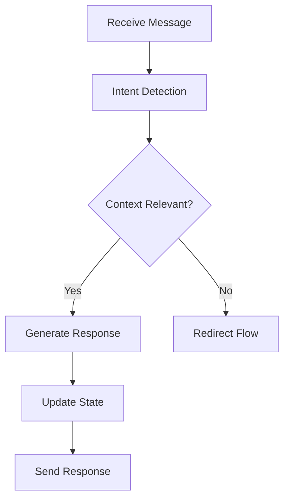
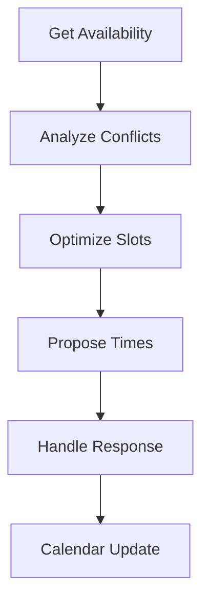
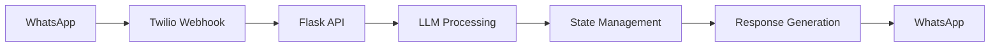

# AI-Powered Interview Scheduling System

An intelligent interview coordination platform leveraging Large Language Models (LLMs) and autonomous AI agents for automated scheduling workflow management. The system uses a multi-agent architecture powered by Google's Gemini Pro LLM, featuring specialized agents for conversation management, scheduling optimization, and system monitoring.

## 🧠 AI Architecture

### LLM Integration

#### Core Model: Google Gemini Pro
- **Primary Agent (Gemini 1.5 Pro)**
  - Context window: Enhanced for long conversation histories
  - Temperature: Dynamic adjustment (0.7-1.0) based on task
  - Model Variants:
    - gemini-1.5-pro: Complex reasoning tasks
    - gemini-1.5-flash: Quick intent detection

#### LangChain Integration
```python
from langchain_google_genai import ChatGoogleGenerativeAI
from langchain.prompts import PromptTemplate

# Model initialization with custom parameters
llm_model = ChatGoogleGenerativeAI(
    model="gemini-1.5-pro",
    temperature=0.7,
)
```

### Multi-Agent System Architecture

#### 1. Conversation Management Agent
```python
def generate_message(self, context):
    """
    Generates contextually aware responses using Gemini Pro.
    Uses custom prompt templates and conversation history analysis.
    """
    prompt_template = PromptTemplate(
        input_variables=[...],
        template=PROMPT_TEMPLATES.GENERATE_MESSAGE_PROMPT_TEMPLATE
    )
    chain = prompt_template | llm_model
```

**Capabilities**:
- Contextual state management
- Multi-turn dialogue handling
- Natural language understanding
- Semantic analysis
- Intent classification
- Multilingual processing

#### 2. Scheduling Intelligence Agent
**Features**:
- Calendar conflict resolution
- Availability optimization
- Meeting duration analysis
- Time zone handling
- Rescheduling management
- Priority-based scheduling

#### 3. Monitoring & Analytics Agent
**Components**:
- Real-time conversation tracking
- Attention flag generation
- Response latency monitoring
- Anomaly detection
- Pattern recognition
- Performance metrics

### AI Prompt Engineering

#### Strategic Prompt Design
```python
PROMPT_TEMPLATE = """
Role: Expert scheduling coordinator
Context: {conversation_history}
State: {conversation_state}
Task: Generate appropriate response considering:
- Participant role: {participant_role}
- Meeting duration: {meeting_duration}
- Previous interactions
- Current context
Output: Natural, context-aware response
"""
```

### Autonomous Workflows

#### 1. Conversation Flow


#### 2. Scheduling Flow


## 🛠 Technical Implementation

### AI Components

#### 1. Natural Language Processing
```python
def check_context_relevance(self, parameters):
    """
    Analyzes message context using Gemini Flash.
    Returns relevance score and context classification.
    """
    llm_model = ChatGoogleGenerativeAI(
        model="gemini-1.5-flash",
        temperature=0.5,
    )
```

#### 2. Intent Detection
```python
def detect_intent(self, message, context):
    """
    Classifies message intent using custom prompt templates.
    Handles multiple languages and contextual nuances.
    """
```

### System Architecture

#### Backend Stack
- Python 3.12
- Flask for API endpoints
- MongoDB for conversation storage
- Redis for state management
- Twilio for WhatsApp integration
- Google Calendar API

#### Frontend Stack
- Next.js 13+ with React
- TypeScript for type safety
- Tailwind CSS for styling
- SWR for data fetching
- shadcn/ui components

### Data Flow Architecture



## 📋 Prerequisites

### AI & Cloud Services
- Google Cloud Platform
  - Gemini Pro API access
  - Cloud Storage
  - Calendar API
- Twilio WhatsApp Business API
- MongoDB Atlas

### Development Environment
- Python 3.9+
- Node.js 16+
- Redis 6+
- Docker & Docker Compose

## ⚙️ Configuration

### AI Configuration (.env)
```bash
# LLM Settings
GOOGLE_API_KEY=your_gemini_api_key
LLM_MODEL_VERSION=gemini-1.5-pro
LLM_TEMPERATURE=0.7
CONTEXT_LENGTH=8192

# State Management
REDIS_URL=your_redis_url
STATE_TTL=3600

# Monitoring
ATTENTION_FLAG_THRESHOLD=24
RESPONSE_TIMEOUT=3600
```

## 🚀 Installation

1. Clone the repository
```bash
git clone <repository-url>
cd schedulebot
```

2. Set up backend
```bash
cd backend
python -m venv venv
source venv/bin/activate  # Windows: .\venv\Scripts\activate
pip install -r requirements.txt
```

3. Set up frontend
```bash
cd frontend
npm install
```

## 💻 Development

### Starting the Services

1. Backend:
```bash
python app.py
```

2. Frontend:
```bash
npm run dev
```

### API Endpoints

#### AI Agent Endpoints

##### Initialize Conversation
- Endpoint: `POST /api/initialize`
- Description: Initialize new AI-driven conversations for interviews
- Sample Payload:
```json
{
  "conversations": [
    {
      "interviewer_name": "John Doe",
      "interviewer_number": "+1234567890",
      "interviewer_email": "john.doe@company.com",
      "interviewer_timezone": "America/New_York",
      "superior_flag": "normal",
      "meeting_duration": 60,
      "interviewees": [
        {
          "name": "Jane Smith",
          "number": "+1987654321",
          "email": "jane.smith@email.com",
          "jd_title": "Senior Software Engineer"
        },
        {
          "name": "Mike Johnson",
          "number": "+1122334455",
          "email": "mike.j@email.com",
          "jd_title": "DevOps Engineer"
        }
      ],
      "role_to_contact_name": "Sarah Wilson",
      "role_to_contact_number": "+1234567899",
      "role_to_contact_email": "sarah.w@company.com",
      "company_details": "Tech Corp is a leading software company specializing in AI solutions."
    }
  ]
}
```

##### Bulk Upload via CSV
- Endpoint: `POST /api/upload-csv`
- Description: Initialize multiple interviews using CSV upload
- Sample CSV Format:
```csv
interviewer_name,interviewer_number,interviewer_email,superior_flag,meeting_duration,interviewee_name,interviewee_number,interviewee_email,jd_title,role_to_contact_name,role_to_contact_number,role_to_contact_email,company_details
John Doe,+1234567890,john.doe@company.com,normal,60,Jane Smith,+1987654321,jane.smith@email.com,Senior Software Engineer,Sarah Wilson,+1234567899,sarah.w@company.com,Tech Corp is a leading software company
John Doe,+1234567890,john.doe@company.com,normal,60,Mike Johnson,+1122334455,mike.j@email.com,DevOps Engineer,Sarah Wilson,+1234567899,sarah.w@company.com,Tech Corp is a leading software company
Alice Brown,+1234567891,alice.b@company.com,high,45,Tom Wilson,+1987654322,tom.w@email.com,Product Manager,Sarah Wilson,+1234567899,sarah.w@company.com,Tech Corp is a leading software company
```

##### Other AI Endpoints
- `POST /api/detect-intent`: Analyze message intent
- `POST /api/generate-response`: Generate AI response
- `POST /api/validate-context`: Check message relevance

#### Scheduling Endpoints
- `POST /api/create_event/<conversation_id>`: Create calendar event
- `GET /api/conversations/active`: Get active conversations
- `GET /api/interviews/scheduled`: Get scheduled interviews

#### Monitoring Endpoints
- `GET /api/attention-flags`: Get AI-generated flags
- `POST /api/attention-flags/<flag_id>/resolve`: Resolve flags

## 📊 Monitoring & Analytics

### AI Performance Metrics
- Response generation time
- Context relevance scores
- Intent detection accuracy
- User satisfaction metrics
- Conversation completion rates
- Error rates and types

### System Health Monitoring
- Agent status tracking
- LLM API latency
- WhatsApp delivery rates
- Calendar sync status
- Database performance
- Cache hit rates

## 🔒 Security & Compliance

### AI Safety Measures
- Input validation
- Output sanitization
- Prompt injection prevention
- Context boundary enforcement
- Personal data handling
- Rate limiting

### System Security
- API authentication
- OAuth 2.0 integration
- Webhook validation
- CORS configuration
- Data encryption
- Audit logging

## 🚀 Future Enhancements

### Planned AI Features
- Custom fine-tuned models
- Advanced sentiment analysis
- Proactive scheduling suggestions
- Multi-calendar optimization
- Personality adaptation
- Learning from interactions

### Technical Roadmap
- GraphQL API integration
- Real-time analytics dashboard
- Enhanced caching strategies
- Automated testing for AI components
- Performance optimization
- Scalability improvements

## 🤝 Contributing

1. Fork the repository
2. Create feature branch (`git checkout -b feature/AIFeature`)
3. Commit changes (`git commit -m 'Add AI feature'`)
4. Push branch (`git push origin feature/AIFeature`)
5. Open Pull Request

## 📄 License

MIT License - See LICENSE file

## 🙏 Acknowledgments

- Google Gemini for AI capabilities
- Langchain for AI orchestration
- Twilio for WhatsApp integration
- MongoDB for data storage
- shadcn/ui for components
- Google Calendar for scheduling